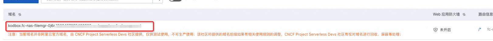

# 服务模板说明文档

## 服务说明

[Kodbox](https://kodcloud.com/product/kodbox/)是一款开源的在线文件管理系统。它可以帮助用户在本地或者服务器上搭建一个私有的云存储平台，
使用户可以通过浏览器访问和管理自己的文件。Kodbox提供了丰富的功能，包括文件上传、下载、预览、分享、权限管理等。
同时，Kodbox支持多种文件格式的在线预览，包括文档、图片、音视频等。Kodbox基于web技术，使用简单方便，
适用于个人用户或者小型团队共享文件。

快速上手流程，本示例对应的Git仓库地址：[kodbox-fc-demo](https://github.com/aliyun-computenest/kodbox-fc-demo)。

本示例会自动的构建计算巢服务，创建过程大约持续5分钟，当服务变成待提交后构建成功。

## 服务架构

本服务基于[函数计算FC](https://help.aliyun.com/zh/fc/)部署Kodbox。服务所属实例会创建一个NAS服务，并将其挂载到一个fc服务上。同时会创建一个fc的function，
用于部署Kodbox。

## 服务构建计费说明

测试本服务构建无需任何费用，创建服务实例涉及的费用参考服务实例计费说明。

## 服务实例部署流程

### 部署步骤
整体部署整体分为三个大步骤：部署计算巢服务实例 -> 访问fc控制台触发服务运行 -> 为访问kodbox服务配置自定义域名。配置完域名后即可通过域名访问kodbox。

0. 部署链接
   

1. 查看服务实例。服务实例创建成功后，部署时间大约需要6分钟。部署完成后，页面上可以看到对应的服务实例。
   

2. 通过服务实例访问FC，可以看到FC对应的http触发器，此时用户可以通过发送HTTP请求触发部署kodbox的函数执行。
   
   
   触发并执行成功后，可以看到kodbox的部署实例。
   
3. 为访问kodbox服务，您需要为该函数调用配置自定义域名，详情可参考：https://help.aliyun.com/zh/fc/configure-a-custom-domain-name
   
4. 步骤3完成后，您可进入fc控制台：高级功能——域名管理，复制域名并访问kodbox服务。
    
    
